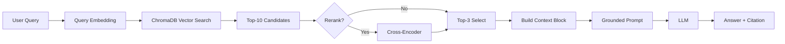

# Architecture — RAG Pipeline (Day 08 Lab)

> Template: Điền vào các mục này khi hoàn thành từng sprint.
> Deliverable của Documentation Owner.

## 1. Tổng quan kiến trúc

```
[Raw Docs]
    ↓
[index.py: Preprocess → Chunk → Embed → Store]
    ↓
[ChromaDB Vector Store]
    ↓
[rag_answer.py: Query → Retrieve → Rerank → Generate]
    ↓
[Grounded Answer + Citation]
```

**Mô tả ngắn gọn:**
Hệ thống này là một trợ lý RAG nội bộ cho khối CS và IT Helpdesk, dùng để trả lời câu hỏi chính sách và quy trình vận hành dựa trên tài liệu nội bộ đã được index. Pipeline gồm 4 bước chính: index tài liệu, retrieve context phù hợp, generate câu trả lời grounded, và đánh giá bằng scorecard. Mục tiêu là giảm hallucination, tăng khả năng trích dẫn nguồn và hỗ trợ đội vận hành tra cứu nhanh các thông tin như SLA, approval và refund policy.

---

## 2. Indexing Pipeline (Sprint 1)

### Tài liệu được index
| File | Nguồn | Department | Số chunk |
|------|-------|-----------|---------|
| `policy_refund_v4.txt` | policy/refund-v4.pdf | CS | sinh tự động khi chạy `build_index()` |
| `sla_p1_2026.txt` | support/sla-p1-2026.pdf | IT | sinh tự động khi chạy `build_index()` |
| `access_control_sop.txt` | it/access-control-sop.md | IT Security | sinh tự động khi chạy `build_index()` |
| `it_helpdesk_faq.txt` | support/helpdesk-faq.md | IT | sinh tự động khi chạy `build_index()` |
| `hr_leave_policy.txt` | hr/leave-policy-2026.pdf | HR | sinh tự động khi chạy `build_index()` |

### Quyết định chunking
| Tham số | Giá trị | Lý do |
|---------|---------|-------|
| Chunk size | 400 tokens (xấp xỉ 1600 ký tự) | Cân bằng giữa độ đầy đủ ngữ cảnh và chi phí embedding/retrieval |
| Overlap | 80 tokens (xấp xỉ 320 ký tự) | Giữ tính liên tục giữa các đoạn, giảm mất ý tại ranh giới chunk |
| Chunking strategy | Heading-based + paragraph fallback | Ưu tiên ranh giới tự nhiên theo section, sau đó tách nhỏ nếu section dài |
| Metadata fields | source, section, effective_date, department, access | Phục vụ filter, freshness, citation |

### Embedding model
- **Model**: `paraphrase-multilingual-MiniLM-L12-v2` (Sentence Transformers, chạy local)
- **Vector store**: ChromaDB (PersistentClient)
- **Similarity metric**: Cosine

---

## 3. Retrieval Pipeline (Sprint 2 + 3)

### Baseline (Sprint 2)
| Tham số | Giá trị |
|---------|---------|
| Strategy | Dense (embedding similarity) |
| Top-k search | 10 |
| Top-k select | 3 |
| Rerank | Không |

### Variant (Sprint 3)
| Tham số | Giá trị | Thay đổi so với baseline |
|---------|---------|------------------------|
| Strategy | Hybrid (Dense + BM25, RRF) | Đổi từ Dense sang Hybrid để tăng precision cho truy vấn có keyword mạnh |
| Top-k search | 10 | Không đổi (giữ nguyên để đảm bảo A/B chỉ đổi 1 biến chính) |
| Top-k select | 3 | Không đổi |
| Rerank | Không dùng | Không đổi |
| Query transform | Không dùng | Không đổi |

**Lý do chọn variant này:**
Chọn hybrid retrieval vì bộ tài liệu chứa cả câu văn tự nhiên (policy) lẫn thuật ngữ/mã chuyên biệt (SLA, approval, refund terms). Dense retrieval cho độ phủ ngữ nghĩa tốt nhưng đôi lúc kéo theo semantic noise; BM25 giúp neo theo từ khóa quan trọng. Kết hợp Dense + BM25 bằng RRF cho kết quả ổn định hơn trong các câu hỏi mang tính tra cứu quy định.

---

## 4. Generation (Sprint 2)

### Grounded Prompt Template
```
Answer only from the retrieved context below.
If the context is insufficient, say you do not know.
Cite the source field when possible.
Keep your answer short, clear, and factual.

Question: {query}

Context:
[1] {source} | {section} | score={score}
{chunk_text}

[2] ...

Answer:
```

### LLM Configuration
| Tham số | Giá trị |
|---------|---------|
| Model | `gemini-3-flash` (mặc định) hoặc `gpt-4o-mini` (fallback qua env) |
| Temperature | 0 (để output ổn định cho eval) |
| Max tokens | 512 |

---

## 5. Failure Mode Checklist

> Dùng khi debug — kiểm tra lần lượt: index → retrieval → generation

| Failure Mode | Triệu chứng | Cách kiểm tra |
|-------------|-------------|---------------|
| Index lỗi | Retrieve về docs cũ / sai version | `inspect_metadata_coverage()` trong index.py |
| Chunking tệ | Chunk cắt giữa điều khoản | `list_chunks()` và đọc text preview |
| Retrieval lỗi | Không tìm được expected source | `score_context_recall()` trong eval.py |
| Generation lỗi | Answer không grounded / bịa | `score_faithfulness()` trong eval.py |
| Token overload | Context quá dài → lost in the middle | Kiểm tra độ dài context_block |

---

## 6. Diagram (tùy chọn)

Sơ đồ dưới đây mô tả flow hiện tại của pipeline từ query đến answer + citation.


